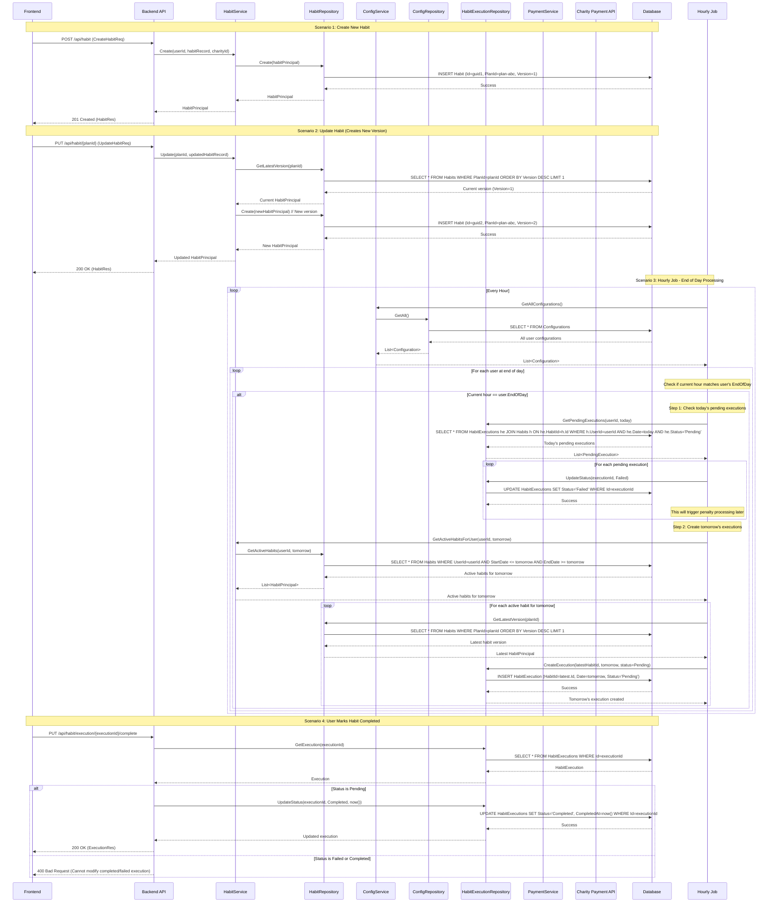

# Habit System - Sequence Diagrams

This document outlines the key flows in the habit tracking system, showing how the frontend, backend, and database interact across different scenarios.

## System Overview

The habit system consists of:

- **Habit Blueprints**: Versioned templates defining habit rules (task, schedule, stakes)
- **Habit Executions**: Daily instances tracking completion status
- **Configuration**: User settings including end-of-day time
- **Financial Processing**: Automatic penalty transfers to charity for failed habits

## Sequence Diagram

## Scenario Descriptions

### 1. Create New Habit

- User defines a new habit with task, schedule, stakes, and charity
- System creates initial version (Version=1) with new PlanId
- Returns habit blueprint to frontend

### 2. Update Habit (Versioning)

- User modifies existing habit (task, stake amount, etc.)
- System creates new version with same PlanId but incremented Version
- Old executions remain linked to previous version for audit trail
- New executions will reference the latest version

### 3. Hourly Job - End of Day Processing

- Runs every hour checking user configurations
- When current hour matches user's EndOfDay setting:
  - **Step 1**: Mark today's pending executions as Failed (triggers penalties)
  - **Step 2**: Create tomorrow's executions with status=Pending
  - Uses latest habit version ID when creating new executions
  - Only processes habits within their StartDate/EndDate period

### 4. User Marks Habit Completed

- Frontend gets execution ID from dashboard
- Only allows updating executions with status=Pending
- Failed or already completed executions cannot be modified
- Direct update with completion timestamp

## TODO: Additional Scenarios

### 5. User Views Dashboard (TODO)

- Shows all active habits for specified date
- Includes completion status for each habit (Pending/Completed/Failed)
- Provides overview of daily progress
- Returns execution IDs for frontend to use in completion flow

### 6. Financial Penalty Processing (TODO)

- Daily job processes all failed executions from previous day
- Transfers stake money to designated charity based on ratio setting
- Marks executions as payment processed to avoid double-charging
- Handles payment failures and retry logic

## Key Design Principles

1. **Versioning**: Habit blueprints are versioned; executions reference specific versions
2. **Temporal Integrity**: Past executions maintain links to rules active when executed
3. **Latest Version Logic**: New executions always use latest version of habit
4. **Automated Processing**: System automatically creates failed executions and processes penalties
5. **User Control**: Users can complete habits early or view their progress anytime
