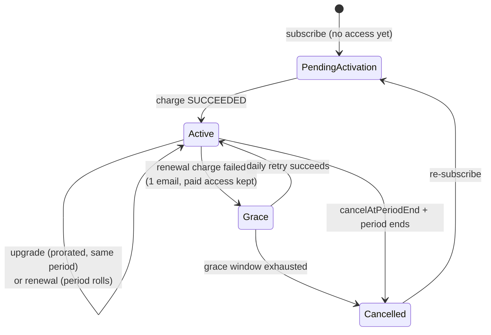

# Subscription Lifecycle

How subscriptions work in zinc: every scenario, what is implemented, and what is planned.

- Engine: `Domain/Subscription/ManagementService.cs`
- Read side / entitlements: `Domain/Subscription/Service.cs`
- Config: `App/Config/settings.yaml` → `Subscription:` (single source of truth for tiers, prices, caps — keep argon `pricing.ts` in sync)
- Portal: `alcohol.argon` `/billing`

Supersedes the billing parts of `subscription-konnect.md` (Konnect was removed 2026-07-06).

## States

One subscription row per user (unique `UserId`). Four statuses, two flags:



- Scheduled downgrade is **not** a status. It is the `NextTier` field, applied at the period roll.
- Pending cancel is the `CancelAtPeriodEnd` flag.
- Undo = flip the field back. No rows are added or deleted. (History comes from the planned event table, below.)
- Read-side backstop: `EffectiveTier` drops a user to `free` from timestamps alone, even if the renewal worker is off. Access is always correct; the stored `Status` may lag.

## Proration rules

| Action                          | Prorate?                | Behavior                                                                                                   |
| ------------------------------- | ----------------------- | ---------------------------------------------------------------------------------------------------------- |
| First subscribe / re-subscribe  | No — full price now     | New 1-month period starts today                                                                            |
| Upgrade (strictly higher price) | **Yes — the only case** | `(new − old) × remaining fraction of period`, floored to the cent (user's favour). Renewal date unchanged. |
| Downgrade (price ≤ current)     | No                      | Scheduled at period end. No refund, no credit.                                                             |
| Cancel / paid → free            | No                      | Access until period end. No refund.                                                                        |
| Renewal                         | No                      | Full price on the anniversary                                                                              |

## Scenarios

### Signing up

1. **Free → Pro / Ultimate** — Full month charged now; period = now → now+1 month. Requires a verified subscription-purpose Airwallex consent, else `NoPaymentConsent`. Charge fails → row stays `PendingActivation`, no access.
2. **Re-subscribe after cancelled** — Same as fresh signup: full price, new period.

### Upgrading (Pro → Ultimate)

3. **Normal upgrade** — Immediate. Charges only the prorated difference (e.g. 20 days left ≈ $2.00, not $7.99). Rounded down. Renewal date does not move.
4. **Upgrade just before renewal** — Prorated amount ≤ $0 → tier flips free of charge; next renewal bills full new price.
5. **Upgrade during a live renewal** — Rejected with `SubscriptionBusy` (5-min renewal lease). Retry shortly.

### Downgrading (Ultimate → Pro)

6. **Normal downgrade** — Nothing changes today. `NextTier` set; applied at period roll. New price billed from then. No refund.
7. **Undo before it happens** — `ChangeTier` to the current tier clears `NextTier`. No charge.

### Cancelling (paid → Free)

8. **Cancel** — `CancelAtPeriodEnd = true`. Full access until period end, then `Cancelled` → effective `free`. No refund, no further charges.
9. **Resume before period end** — Flag cleared. No charge; original renewal date stands.
10. **Cancel, then pick a cheaper plan** — The scheduled downgrade replaces the cancellation. Current plan until period end, then switch.

### Renewal day

11. **Payment succeeds** — Period rolls one month; receipt sent.
12. **Payment fails → Grace** — Paid features kept. Exactly one payment-failure email (on the Active→Grace edge). Card retried daily, silently, with a fresh idempotency key per day.
13. **Retry succeeds during grace** — Back to `Active`, period rolls, receipt sent.
14. **Grace runs out** — Window = `GracePeriodDays` (7, global) **measured from the original period end**, not from each retry. Then `Cancelled`, effective `free`, one "subscription ended" email. Nothing deleted.
15. **Tier change while in Grace** — Rejected. Settle the payment or cancel first.

### Limits after downgrade

16. **More habits than the new cap** — Policy (decided 2026-08-01): never delete. Oldest habits stay active up to the new cap; the rest become read-only/paused. Upgrading reactivates them.
    Implementation (2026-08-01): `Habits.PausedByLimit` flag, distinct from the user's own `Enabled` toggle. Paused habits are skipped by the daily failure scan (no penalties, streak frozen), rejected on complete/skip/update with `TierInsufficient`, and don't occupy a creation slot (delete an active habit → create a fresh one). Reconciliation (`IEntitlementService.ReconcileHabitPause` → `SetPausedOverCap`) runs on every tier landing — activate, $0 flip, renewal roll, lapse, cancel-end — ranking **currently-active first, then oldest first, Id tiebreak**, so a monthly roll never re-pauses a habit the user swapped in. Best-effort: a reconcile failure never fails the money flow; the next roll self-heals.
17. **Skips / vacation windows already used this period** — They stand. No claw-back. Existing vacation windows are not cancelled.

## Implementation status

### Built and live

Scenarios 1–10, 17. Enforcement gates (`EntitlementService`) block _new_ over-cap actions. 82+ unit tests green.

### Built but switched off 🔴

Scenarios 11–15. The renewal worker (`SubscriptionRenewalHostedService`, daily tick, batch 500, DB lease + idempotency keys) is gated by `Subscription.RenewalEnabled`, which is **`false` in every config** — no landscape overrides it. So today: no renewals are charged, no grace emails, no retries, no lapse writes. Only the read-side backstop protects access. **Enable in pichu first and observe.**

### Not built ❌

- ~~#16 over-cap pause~~ — **built 2026-08-01** (see scenario 16). Still missing: exposing `pausedByLimit` in habit API responses so neon/argon can render the paused badge (comes with the UX step).
- **Append-only billing event table** (decided 2026-08-01) — see below.
- **Receipts / billing history** — no ledger exists; `LastChargeIntentId/Key` is transient and cleared.
- **Grace countdown in UI** — backend computes the deadline; API/portal never expose it. Portal still says "Renews on …" during grace.
- **Billing preview** — no "you'll pay $X today" endpoint. Portal upgrade copy is **wrong** (claims full price + period restart; backend prorates and keeps the anniversary).
- **Undo-downgrade button** — backend supports it (#7); portal renders no affordance.
- **`payment_intent.*` webhooks** — commented out; a 3DS-later-settled charge only recovers via the daily reconcile (currently off).
- Annual billing, trials, coupons, refunds — out of scope for now.

## Planned: append-only billing event table

The live `UserSubscriptions` row stays the single source of _current_ truth. History goes to a new append-only table (never updated, never deleted):

```
SubscriptionEvents
├─ Id, UserId, OccurredAt (UTC)
├─ EventType: subscribed | activated | upgraded | downgrade_scheduled |
│             downgrade_undone | downgrade_applied | cancelled | resumed |
│             renewed | charge_failed | grace_entered | grace_recovered |
│             lapsed | charge_succeeded
├─ Tier / NextTier snapshot
├─ AmountCents, Currency, ChargeIntentId (money events)
└─ Metadata (json)
```

Written in the same transaction/flow as each state change. Powers: receipts + billing history page, audit ("did we ever schedule this downgrade?"), dunning/ops debugging, and future invoices.

## Rollout order

1. Fix argon upgrade copy (it currently misstates proration) — small.
2. Enable `RenewalEnabled` in pichu; monitor the worker.
3. Implement #16 (pause over-cap habits, oldest-first keep).
4. Event table → then receipts, grace countdown, billing preview, undo-downgrade button.
